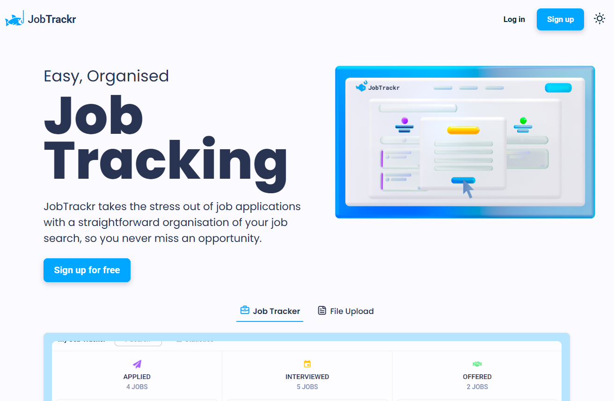

 

  

<h3 align="center">JobTrackr</h3>

  

    JobTrackr is an easy to use job tracking app, allowing users to organise and track their job applications. 
     
    <a href="https://github.com/jloizel/jobtrackr"><strong>Explore the docs »</strong></a>
     
     
    <a href="https://www.jobtrackr.co.uk/">View Live Project</a>
    ·
    <a href="https://github.com/jloizel/jobtrackr/issues/new?labels=bug&template=bug-report---.md">Leave some Feedback</a>
    ·
    <a href="https://github.com/jloizel/jobtrackr/issues/new?labels=enhancement&template=feature-request---.md">Request Feature</a>
  

<!-- ABOUT THE PROJECT -->
## 📝 About The Project

Jobtrackr is an online service built to help job seekers in organising their job search effectively. With a tool for tracking application statuses and statistics, users can stay on top of their job hunt and maintain a structured and efficient approach.

This app allows users to log into their personal account, add details about job applications, and track their progress, from submission to offer. The platform offers a clean and intuitive interface, ensuring that users can focus on finding the right opportunity without getting lost in messy spreadsheets.

The development of this project improved my experience with user authentication and further developed my skills of database integration and responsive interfaces.

### Built With (***non-exhaustive***)

<code></code>
<code></code>
<code></code>
<code></code>
<code></code>
<code></code>

 

## 🚀 Features

- **Responsive Design**: Ensures optimal user experience across all devices, including mobile, tablet, and desktop.
- **User-Friendly Job Tracking Interface**: Designed for intuitive navigation, making it easy for both job seekers to add a job and change its status with a drag & drop feature.
- **Upload CV / Cover Letter Form**: Allows users to upload and store their personal files making them accessible from anywhere.
- **Log In / Sign Up Form**: User registration enabling users to access their job tracker from any device.

(<a href="#readme-top">back to top</a>)

